# LLM Inference & Serving Systems Lab

[](https://github.com/XianghaoKong/llm-serving-systems-lab/actions/workflows/ci.yml)
[](LICENSE)

A measurement-driven investigation of LLM inference performance—from attention kernels and streaming APIs to queueing, continuous batching, KV-cache pressure, serving-engine trade-offs, and production-oriented observability.

The central result is:

> **LLM serving performance is a stack-level property. The configuration with the highest raw throughput is not necessarily the configuration with the best user-visible latency or SLO-qualified capacity.**

## Highlights

- Measured a **2.25× long-context TTFT improvement** from Flash Attention on an RTX 4070.
- Identified a vLLM **tail-latency knee between 3.75 and 4.0 configured requests/s**.
- Showed request goodput falling by approximately **10.7%** even while raw throughput continued increasing.
- Reduced the KV pool from **66.54 GiB to 7.00 GiB**, driving peak occupancy from **10.5% to 99.8%** without preemption.
- Compared vLLM and SGLang across concurrency **1, 8, 32, 64, and 128**, using five repeated runs per point.
- Built a **Prometheus + DCGM Exporter + Grafana** observability stack.
- Completed a **100,000-request, 35-minute C64 soak** with zero failures, zero preemptions, and no persistent memory growth.
- Reduced a 24K-prefill-induced decode P99 stall from **51.89× to 4.23×** by tuning vLLM's chunked-prefill budget, with five repeated blocks and bootstrap confidence intervals.
- Reproduced the scheduler direction on **Qwen2.5-7B**: 4K and 1K chunk budgets reduced the decode stall ratio by **77.9% and 93.3%**, respectively.
- Implemented Triton/TileLang RMSNorm, SwiGLU and W4A16 kernels with **5,120 timing records**; measured a **2.34× RMSNorm forward improvement** over the tested dynamic `torch.compile` configuration at BF16 512 × 3584, while retaining regressions and numerical failures in the report.
- Measured **2,100 distributed-training updates** on four A100s: ZeRO-3 reduced peak allocated memory by **29.9%** versus ZeRO-1 at a **40.4% throughput cost**, after a reference-update gate rejected a numerically faulty baseline.

## System under test

| Layer | Configuration |
|---|---|
| Model | Qwen/Qwen2.5-1.5B-Instruct |
| S8-D extension model | Qwen/Qwen2.5-7B-Instruct |
| Serving GPU | 1× NVIDIA A100 80GB PCIe |
| Kernel baseline GPU | 1× NVIDIA RTX 4070 12GB |
| S9 fused-kernel GPU | 1× NVIDIA A100 80GB PCIe |
| S10 training GPU | One host with 4× NVIDIA A100 SXM 80GB; NVLink between every GPU pair |
| S10 training workload | Random 7B-class Qwen-shaped models; BF16, synthetic tokens, AdamW |
| Serving precision | BF16 |
| Serving engines | vLLM 0.28.0 and SGLang 0.5.19 |
| Request shape for S6/S7 | 512 input / 128 output tokens |
| S8 background population | C64, 256 input / 8,192 output tokens |
| S8 injected prompts | 8K, 16K, or 24K input / 16 output tokens |
| Maximum serving context | 32,768 tokens |
| Monitoring | Prometheus, DCGM Exporter, Grafana |
| Telemetry interval | 1 second |

Exact software and driver records are stored in [`docs/`](docs/).

## Investigation structure

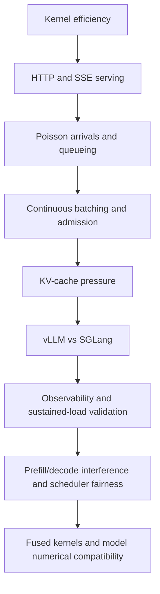

The experiments first move upward through the serving stack, distinguishing GPU execution cost from scheduler delay, queueing, cache capacity and engine-specific behavior. S9 returns to operator internals to test fusion against compiled/library baselines and model-level numerical checks.

## Key findings

### 1. Kernel improvements do not eliminate serving latency

On the RTX 4070 baseline, Flash Attention improved 3K–4K-token TTFT by approximately **2.25×** and increased median decode throughput from **55.6 to 67.4 tok/s**.

However, under bursty FCFS traffic, request TTFT later increased to tens of seconds while GPU token latency remained around **15–16 ms**. At that point, queueing—not token execution—had become the dominant source of user-visible latency.

### 2. SLO capacity was reached before maximum raw throughput

A request passed the serving SLO when:

- TTFT ≤ 300 ms
- mean SSE content-event ITL ≤ 15 ms

| Configured arrival rate | SLO pass rate | Raw request throughput | Request goodput |
|---:|---:|---:|---:|
| 3.50 req/s | 98.33% | 2.795 req/s | 2.748 req/s |
| 3.75 req/s | 98.33% | 2.913 req/s | **2.864 req/s** |
| 4.00 req/s | 86.67% | 2.953 req/s | 2.559 req/s |

From 3.75 to 4.0 configured requests/s:

- raw request throughput increased slightly;
- P95 TTFT increased from **232.7 to 559.3 ms**;
- P99 TTFT increased from approximately **251 to 1,622 ms**;
- request goodput decreased by approximately **10.7%**;
- output goodput decreased from approximately **546.4 to 477.5 tok/s**.

This is a latency and SLO knee, not evidence of a universal hard throughput limit.

### 3. KV occupancy alone does not explain scheduler pressure

S5 constrained the vLLM KV-cache pool while holding the workload constant.

| KV pool | Peak KV occupancy | Max running | Max waiting | P95 TTFT | Output throughput |
|---:|---:|---:|---:|---:|---:|
| 66.54 GiB | 10.50% | 8 | 7 | 10.392 s | 86.82 tok/s |
| 14.00 GiB | 49.92% | 8 | 7 | 10.442 s | 86.53 tok/s |
| 7.78 GiB | 89.85% | 8 | 7 | 10.447 s | 86.50 tok/s |
| 7.00 GiB | 99.84% | 8 | 7 | 10.446 s | 86.50 tok/s |
| 6.75 GiB | 90.62% | 7 | 7 | 10.579 s | 85.75 tok/s |

No preemptions occurred.

At 7.00 GiB, occupancy reached **99.84%** without meaningful throughput collapse. At 6.75 GiB, the scheduler admitted only seven running requests, so measured occupancy fell even though memory capacity was tighter.

The result illustrates an important diagnostic boundary:

> KV utilization is the occupancy of the admitted working set—not a complete measurement of unmet demand.

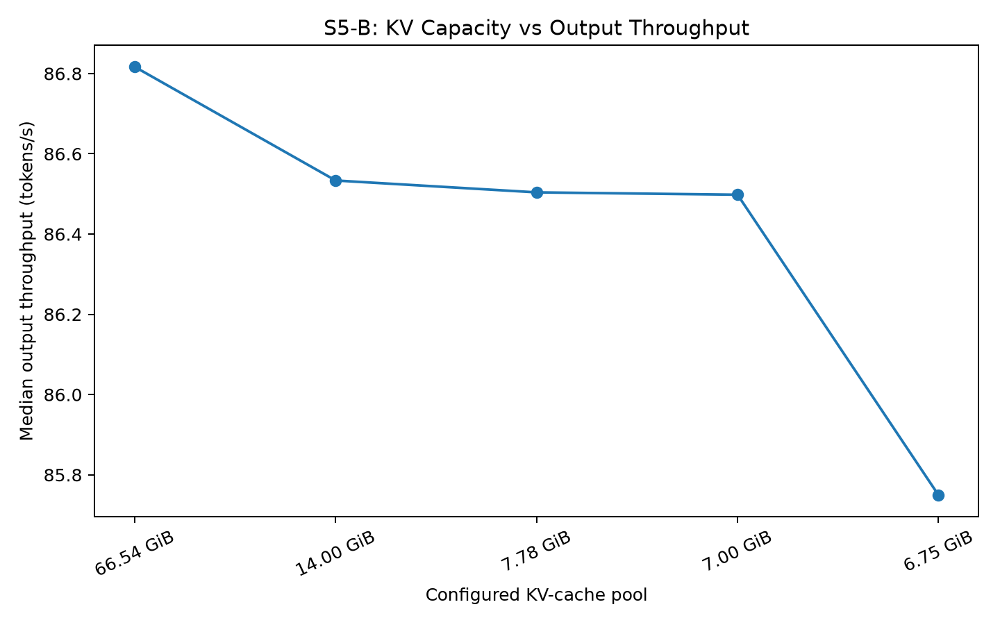

### 4. Serving-engine rankings depend on concurrency and metric

S6 compared vLLM and SGLang using the same model, precision, request shape, concurrency points, and five repeated runs per configuration.

| Concurrency | vLLM output tok/s | SGLang output tok/s | Throughput leader |
|---:|---:|---:|---|
| 1 | 226.50 | 257.49 | SGLang +13.7% |
| 8 | 1,756.46 | 1,815.73 | SGLang +3.4% |
| 32 | 4,832.48 | 4,852.46 | Approximately equal |
| 64 | 6,692.62 | 6,921.83 | SGLang +3.4% |
| 128 | 7,809.37 | 7,267.41 | vLLM +7.5% |

At C64, SGLang produced:

- **3.4% higher** output throughput;
- **9.7% lower** P95 end-to-end latency;
- **83.4% lower** P95 ITL.

At the same concurrency, vLLM produced lower median, P95, and P99 TTFT. At C128, vLLM overtook SGLang in both throughput and end-to-end latency.

Therefore, the comparison does not support a universal “faster engine.” Engine selection depends on concurrency, TTFT, streaming cadence, throughput, and tail-latency priorities.

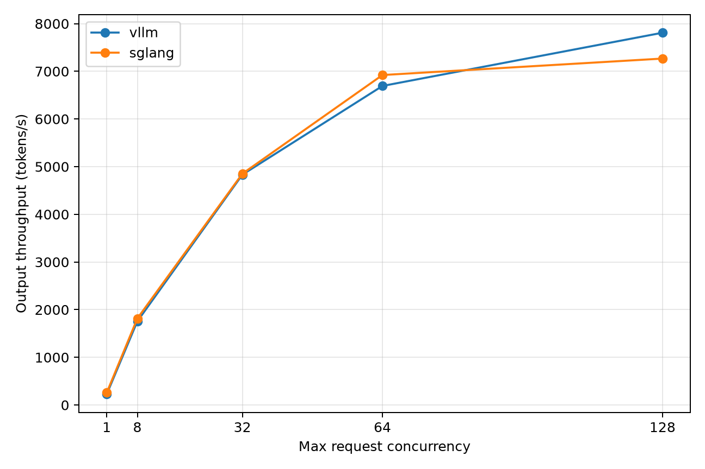

### 5. High queue pressure can coexist with low KV occupancy

The S7 load transition increased concurrency through:

| Stage | Concurrency | Output throughput | Mean waiting | Mean KV occupancy | Preemptions |
|---|---:|---:|---:|---:|---:|
| C8 | 8 | 1,763.6 tok/s | 0.0 | 0.18% | 0 |
| C32 | 32 | 4,828.6 tok/s | 2.2 | 0.63% | 0 |
| C64-A | 64 | 6,730.6 tok/s | 7.6 | 1.19% | 0 |
| C128 | 128 | 7,789.4 tok/s | 22.8 | 2.27% | 0 |
| C64-B | 64 | 6,669.1 tok/s | 8.5 | 1.15% | 0 |

At C128, the queue grew to a mean of **22.8 waiting requests** while KV occupancy remained only **2.27%** and preemptions remained zero.

This indicates scheduler or compute saturation rather than KV exhaustion.

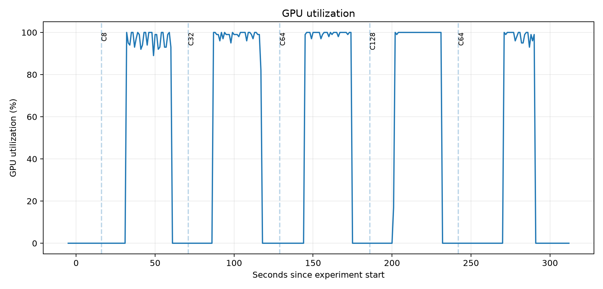

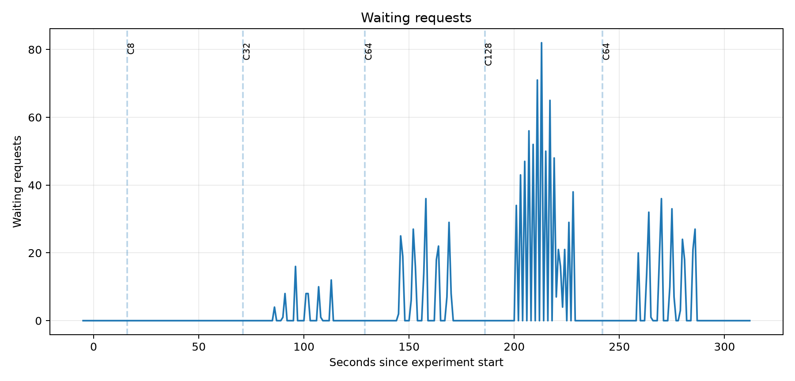

### 6. Sustained C64 load remained stable

The formal soak executed five consecutive 20,000-request segments:

| Property | Result |
|---|---:|
| Total successful requests | 100,000 / 100,000 |
| Wall-clock duration | 2,102 s |
| Active serving duration | 1,935.4 s |
| Preemptions | 0 |
| Minimum vLLM scrape availability | 1 |
| Minimum DCGM scrape availability | 1 |
| Idle framebuffer-memory delta | 0 MiB |

Performance drift from segment 1 to segment 5:

| Metric | Drift |
|---|---:|
| Output throughput | +0.156% |
| P95 TTFT | −1.099% |
| P99 TTFT | +1.735% |
| P95 TPOT | −0.334% |
| P95 ITL | +0.832% |
| P99 ITL | −0.291% |

Across the five active segments:

- GPU utilization remained approximately **99.1–99.3%**;
- mean waiting depth remained between **7.43 and 7.77**;
- mean KV occupancy remained between **1.168% and 1.197%**;
- mean power remained between **294.8 and 296.8 W**;
- maximum GPU temperature remained between **72 and 73°C**.

Framebuffer memory returned to the same **74,382 MiB** idle baseline after the soak, while idle KV occupancy returned to zero. No cumulative performance, queue, KV, or device-memory growth was observed.

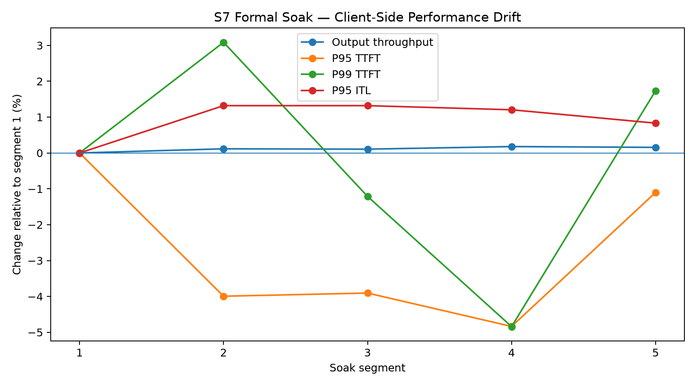

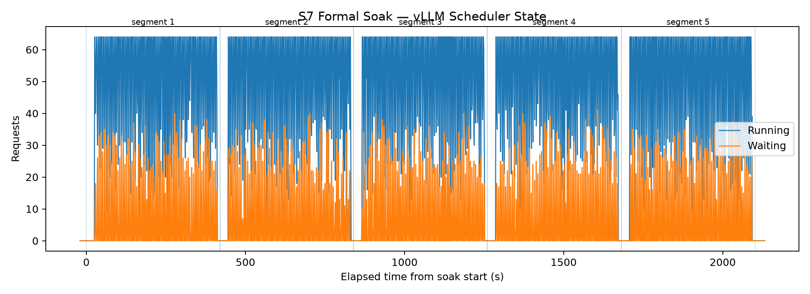

## Observability stack

S7 correlates three evidence layers:

1. Client-side latency and throughput.
2. vLLM scheduler, KV-cache, and preemption metrics.
3. DCGM GPU utilization, power, temperature, and framebuffer memory.

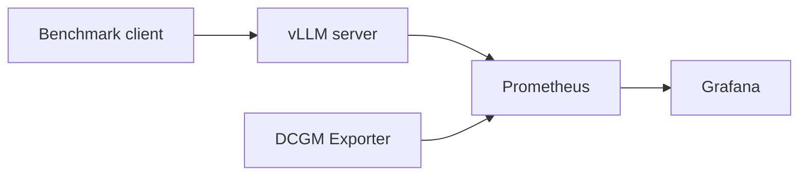

The repository includes:

- Prometheus scrape configuration;
- a curated DCGM metric set;
- Grafana datasource and dashboard provisioning;
- a 15-panel dashboard JSON;
- exported 1 Hz telemetry;
- static figures suitable for offline review.

The dashboard covers GPU telemetry, scheduler state, KV occupancy, preemptions, scrape availability, latency quantiles, and token throughput.

See [`docs/s7_observability.md`](docs/s7_observability.md) for the complete S7 experiment and diagnosis narrative.

### 7. Prefill chunk size controls decode fairness

S8 injected one deterministic long prompt into 64 active decode requests and
measured the resulting background P99 content-event gap against the same run's
pre-injection baseline. Each of eight scheduler configurations was repeated in
five rotated blocks at 8K, 16K, and 24K input lengths.

For a 24K-token prompt:

| Chunked-prefill budget | P99 stall ratio | Median max gap | Long-request TTFT |
|---:|---:|---:|---:|
| off, 32K | 51.89× | 701.2 ms | 752.2 ms |
| on, 8K | 21.09× | 316.8 ms | 841.0 ms |
| on, 2K | 8.96× | 105.9 ms | 1,067.4 ms |
| **on, 1K** | **4.23×** | **70.2 ms** | **1,415.6 ms** |
| on, 512 | 3.78× | 59.0 ms | 2,158.8 ms |

The feature toggle alone did not improve isolation: the 32K enabled budget was
statistically similar to the unchunked baseline. Stalls fell only when the
budget forced the long prefill to yield. A 1K budget was the observed Pareto
knee; halving it to 512 tokens bought only 10–13% lower stall ratios across
prompt lengths while increasing TTFT by approximately 49–53%.

The explicit S8-C dual-SLO analysis uses a 100 ms background P99-gap target
and a 1.5 s long-request TTFT target. The feasible set contains 2K, 1K, and
512-token budgets at 8K and 16K prompt lengths; at 24K, only the 1K budget
satisfies both objectives. See [`docs/s8_pareto_results.md`](docs/s8_pareto_results.md).

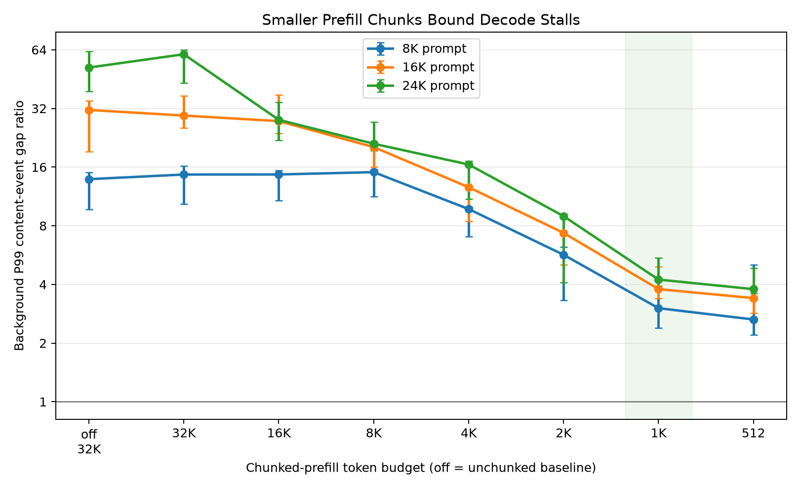

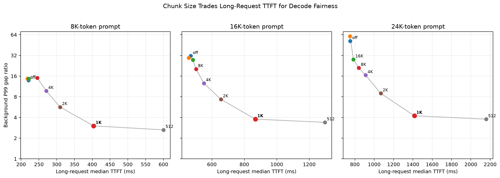

See [`docs/s8_results.md`](docs/s8_results.md) for confidence intervals,
controls, validity checks, and the full artifact index. The diagnostic follow-up
in [`docs/s8_profiler_protocol.md`](docs/s8_profiler_protocol.md) uses dynamic
Nsight Systems capture to test the proposed GPU execution mechanism.

S8-B completed 20 Nsight trials. Smaller chunk budgets reduced the longest
observed kernel from 12.696 ms unchunked to 4.189 ms at 4K and 1.864 ms at 1K,
while the matched decode stall fell in the same order. The 50-microsecond
busy-interval union did not vary monotonically because near-continuous short
kernels merged across the longer 1K capture window; this negative result and
the mechanism boundary are documented in
[`docs/s8_profiler_results.md`](docs/s8_profiler_results.md).

S8-D then ran 15 formal Qwen2.5-7B trials at calibrated C16. Relative to
unchunked execution, 4K and 1K budgets reduced the P99 stall ratio by 77.9%
and 93.3%, at TTFT costs of 6.4% and 21.2%. See
[`docs/s8_model_extension_results.md`](docs/s8_model_extension_results.md).

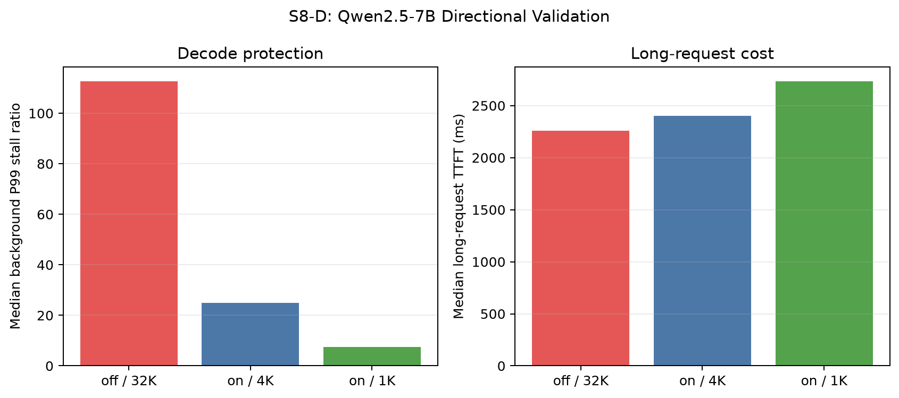

## S9: fusion must survive strong baselines and numerical checks

The A100 study covers RMSNorm and SwiGLU forward/backward in FP16/BF16, plus
packed W4A16 dequantization-GEMM. **1,024 cells × five blocks** compare eager
PyTorch, dynamic `torch.compile`, Liger, custom Triton and custom TileLang where
applicable. Separate Kineto traces check launch structure and resource metadata.

RMSNorm forward improves over the tested compiler configuration; small SwiGLU
inputs are often already well fused. W4 fusion cuts an example from ten kernels
to one and reduces temporary allocation, but the fixed custom tiles lose to
predequantized cuBLAS. A fully fused Qwen RMSNorm candidate fails the model-logit
gate despite passing operator tolerances; a compatibility path preserves the
native variance reduction.
That compatible path matches the checked model outputs but is about **5.9%
slower** in the length-matched replay, so the kernel-level win is not presented
as an end-to-end serving improvement.

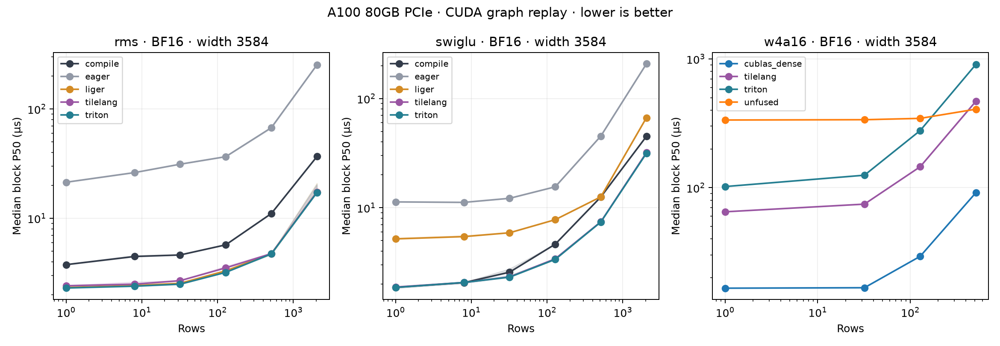

See the [S9 results](docs/s9_results.md) and [protocol](docs/s9_kernel_protocol.md)
for strong-baseline comparisons, rejected pilots, the 200-request length-matched
model replay, and the distinction between Kineto estimates and unavailable
hardware counters. These model-path measurements are not vLLM serving gains.

## S10: distributed training needs numerical gates

The training extension compares DeepSpeed ZeRO state sharding and Megatron-Core
TP/PP layouts on one four-A100 host. Global input tokens per update remain fixed
as data-parallel degree changes. Capacity failures, independent repeated runs,
and separate communication profiles are retained.

A tiny-model AdamW reference check rejected a DeepSpeed 0.17.6 ZeRO-2 baseline
despite finite losses. The accepted runtime pins **DeepSpeed 0.17.5** after
checking both parameter updates and gradient norms on two and four ranks.
Megatron-Core uses its pinned 0.14.0 local backend; cross-framework throughput
differences are not attributed solely to parallelism.

Across three independent runs per layout, four-rank ZeRO-3 reduces peak allocated
memory from **56.76 to 39.77 GiB** relative to ZeRO-1, at a **40.4% throughput
cost**. Two-to-four-rank ZeRO-3 scaling is **1.89×** at fixed global tokens.
Within Megatron's local backend, PP4 reaches **1.49×** TP4 throughput with about
**5.58 GiB** more peak memory. Per-run ranges and separate NCCL profiles preserve
the measurement limits.

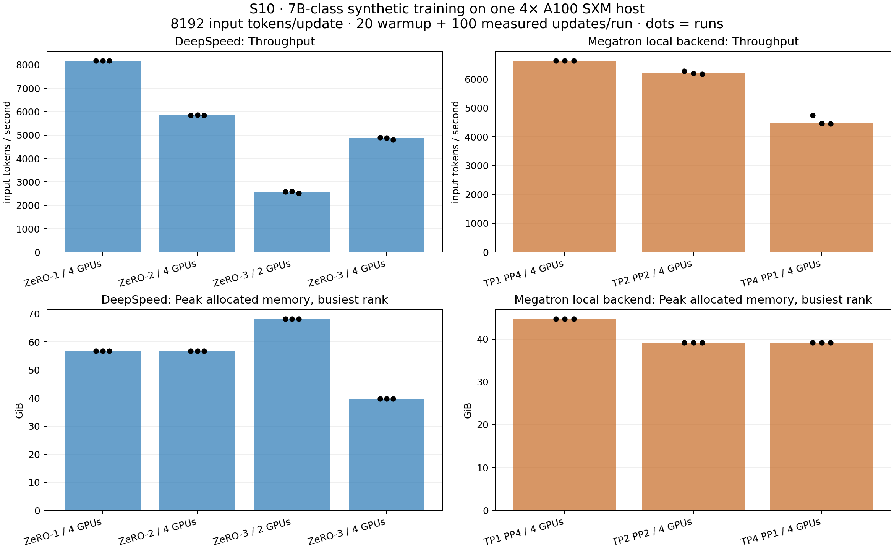

See the [S10 results](docs/s10_results.md), [protocol](docs/s10_distributed_protocol.md) and
[numerical regression case study](docs/s10_numerical_regression.md).
These are synthetic training-system measurements, not convergence or serving
benchmarks.

## Experimental progression

| Stage | Question |
|---|---|
| R0 | How can a reproducible heterogeneous workload be constructed? |
| R1 | How much do attention backends change TTFT, decode speed, and memory? |
| S1 | What measurement semantics appear after adding HTTP/SSE streaming? |
| S2 | When does queueing dominate client-visible latency? |
| S3 | How do continuous batching and active-concurrency limits affect tails? |
| S4 | Where does SLO-qualified goodput peak? |
| S5 | What changes as the KV-cache pool approaches capacity? |
| S6 | How do vLLM and SGLang trade places across concurrency and metrics? |
| S7 | Can client, scheduler, and GPU telemetry explain load transitions and stability? |
| S8 | How does chunked-prefill scheduling trade long-request TTFT for decode fairness? |
| S9 | When does operator fusion beat compiled baselines and preserve pretrained-model behavior? |
| S10 | How do state sharding and TP/PP trade capacity, throughput and communication after numerical checks? |

## Repository structure

```text
.
├── README.md
├── docs/
│   ├── s6_environment.txt
│   ├── s7_observability.md
│   ├── s8_experiment_protocol.md
│   ├── s8_model_extension_results.md
│   ├── s8_profiler_protocol.md
│   ├── s8_profiler_results.md
│   ├── s8_results.md
│   ├── s9_kernel_protocol.md
│   ├── s9_results.md
│   ├── s10_distributed_protocol.md
│   ├── s10_numerical_regression.md
│   └── s10_results.md
├── monitoring/
│   ├── dcgm/
│   ├── grafana/
│   │   ├── dashboards/
│   │   └── provisioning/
│   └── prometheus/
├── results/
│   ├── r1/
│   ├── s2/
│   ├── s3/
│   ├── s4/
│   ├── s5/
│   ├── s6/
│   ├── s7/
│   ├── s8/
│   ├── s9/
│   └── s10/
├── src/
└── workloads/
    └── final/
```

Raw traces, server logs, full prompts, and temporary benchmark outputs are intentionally excluded from version control. Public summaries, analysis-ready telemetry, figures, scripts, and workload metadata are retained.

## Reproducing the analysis

Earlier analysis stages:

```bash
python src/r1_analyze_results.py
python src/s2_analyze_results.py
python src/s3_analyze_results.py
python src/s4_analyze_goodput.py
python src/s5b_analyze_results.py
python src/s6a_analyze_results.py
```

S7 load transition and soak analysis:

```bash
/root/.venv-s6-sglang/bin/python \
  src/s7_analyze_load_transition_v2.py

/root/.venv-s6-sglang/bin/python \
  src/s7_analyze_soak.py

/root/.venv-s6-sglang/bin/python \
  src/s7_export_soak_telemetry.py
```

S8 prefill/decode interference analysis:

```bash
/root/.venv-s6-sglang/bin/python \
  src/s8_analyze_interference.py \
  --input-root results/s8/raw/interference_formal/<run-id>
```

S8-B Nsight Systems mechanism validation:

```bash
S8_PROFILE_REPEATS=5 bash src/run_s8_profile.sh
```

S8-D Qwen2.5-7B directional validation:

```bash
S8D_PHASE=calibration bash src/run_s8_model_validation.sh
S8D_PHASE=formal S8D_BACKGROUND_CONCURRENCY=16 \
  bash src/run_s8_model_validation.sh
```

Formal GPU runs are launched through the corresponding `run_*.sh` scripts in [`src/`](src/). These commands require the appropriate model, serving engine, GPU environment, and raw experiment inputs.

S9 (use the pinned CUDA environment in `requirements-s9.txt`):

```bash
MODEL=/path/to/Qwen2.5-1.5B-Instruct bash src/run_s9.sh
```

Accepted per-block S9 measurements are included under `results/s9/runs/`;
the protocol records arithmetic, compilation, profiling and replay boundaries.

S10 analysis uses published rank records and requires no GPU:

```bash
python src/s10_analyze.py results/s10/runs --output results/s10/analysis
python src/s10_plot.py results/s10/analysis/runs.json results/s10/analysis/distributed_training.png
python src/s10_verify_results.py
```

GPU reproduction uses the pinned setup and explicit matrices described in the
[S10 report](docs/s10_results.md). Capacity failures and rejected numerical
pilots remain separate from accepted formal timing runs.

## Measurement boundaries

- Natural generation can diverge across execution stacks because of numerical and scheduling differences.
- SSE content-event ITL is an application-level streaming metric and is not identical to GPU TPOT.
- CUDA or DCGM framebuffer usage includes model weights, allocator reservations, graphs, and cache pools; it is not equivalent to active KV occupancy.
- A concurrency cap only changes behavior when the uncapped scheduler would exceed that limit.
- Capacity and latency knees are specific to the tested model, GPU, software stack, workload distribution, and finite request trace.
- The absence of degradation in this soak is evidence for this experiment window, not proof of unlimited long-run stability.

## Main takeaway

The bottleneck moved upward through the stack as lower-level execution became more efficient:

> **kernel cost → API semantics → queueing → batching → admission control → KV capacity → engine policy → operational stability**

S8 extends that chain to scheduler fairness: a long prefill can interrupt decode
cadence even with zero waiting, zero preemptions, and low KV occupancy. The
prefill chunk budget determines how often decode work gets another scheduling
opportunity.

For this workload, raw throughput continued increasing after tail latency and SLO-qualified goodput had already degraded. Production-oriented LLM serving therefore requires joint reasoning about throughput, latency distributions, queue depth, admission behavior, memory occupancy, and GPU telemetry—not optimization of a single metric.

## License

This project is available under the [MIT License](LICENSE).
