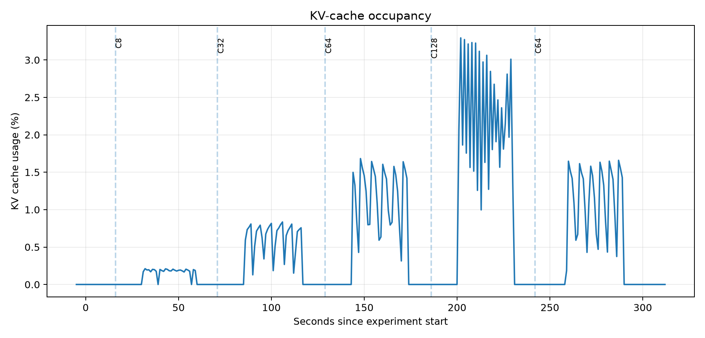
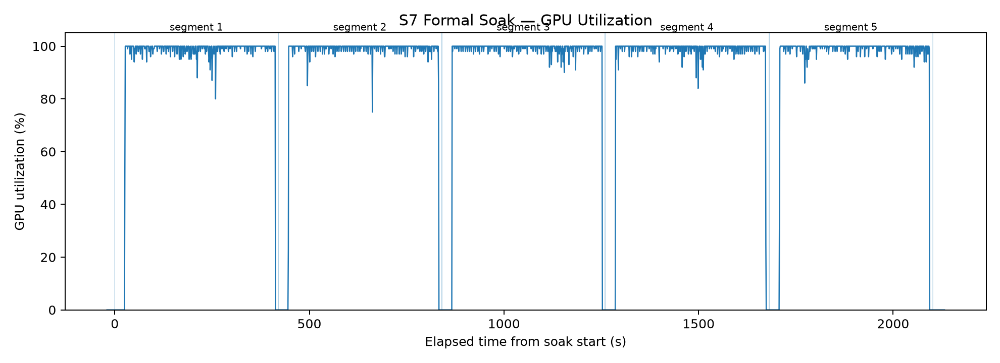
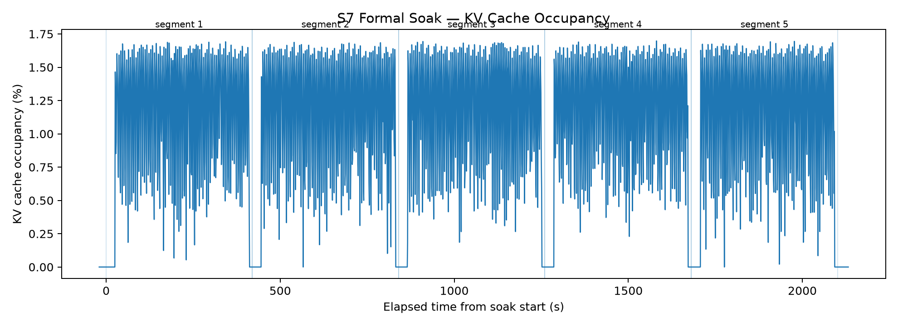
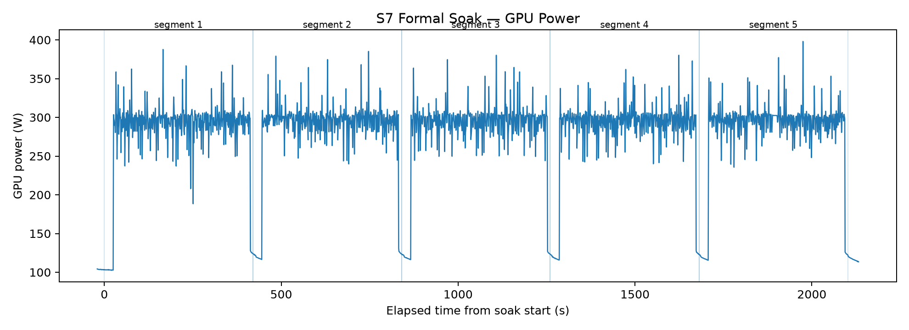

# S7: LLM Serving Observability and Stability

## Objective

S7 evaluates how a single-GPU vLLM serving system behaves as concurrency
increases and whether performance remains stable under sustained saturation.

The experiment correlates three layers of evidence:

1. Client-side throughput and latency.
2. vLLM scheduler and KV-cache telemetry.
3. NVIDIA GPU utilization, power, temperature, and framebuffer memory.

This makes it possible to distinguish compute or scheduler saturation from
KV-memory pressure and to check whether repeated load causes cumulative
performance or memory degradation.

## Test environment

| Component | Configuration |
|---|---|
| GPU | 1× NVIDIA A100 80GB PCIe |
| Model | Qwen2.5-1.5B-Instruct |
| Precision | BF16 |
| Serving engine | vLLM |
| Request shape | 512 input tokens / 128 output tokens |
| Monitoring | Prometheus + DCGM Exporter + Grafana |
| Scrape interval | 1 second |

## Observability stack

The telemetry path is:

Benchmark client → vLLM server → Prometheus → Grafana

DCGM Exporter supplies GPU telemetry to the same Prometheus instance, allowing
client behavior, scheduler state, and GPU behavior to be compared on a shared
timeline.

The stack captures:

- Request and token throughput.
- TTFT, ITL, TPOT, and end-to-end latency.
- Running and waiting requests.
- Capacity and deferred waiting reasons.
- KV-cache occupancy and preemptions.
- GPU utilization, power, temperature, and framebuffer memory.
- Prometheus target availability.

Configuration is stored under:

- `monitoring/dcgm/s7-counters.csv`
- `monitoring/prometheus/prometheus.yml`
- `monitoring/grafana/dashboards/s7_llm_serving.json`
- `monitoring/grafana/provisioning/dashboards/dashboards.yml`
- `monitoring/grafana/provisioning/datasources/prometheus.yml`

## Load-transition experiment

The workload increased through C8 → C32 → C64-A → C128 → C64-B.

Returning from C128 to C64 provides a recovery check. If C64-B resembles C64-A,
the C128 pressure did not leave persistent degradation.

### Results

| Stage | Output tok/s | P95 TTFT | P95 E2E | Mean waiting | Mean KV | Mean GPU |
|---|---:|---:|---:|---:|---:|---:|
| C8 | 1,763.62 | 90.55 ms | 585.98 ms | 0.00 | 0.177% | 93.62% |
| C32 | 4,828.57 | 274.11 ms | 876.68 ms | 2.19 | 0.631% | 95.74% |
| C64-A | 6,730.61 | 517.85 ms | 1,323.75 ms | 7.63 | 1.188% | 96.20% |
| C128 | 7,789.40 | 1,022.46 ms | 2,406.79 ms | 22.80 | 2.268% | 97.20% |
| C64-B | 6,669.11 | 542.97 ms | 1,289.67 ms | 8.52 | 1.152% | 60.32%* |

\*The C64-B GPU mean includes sampled low-utilization boundary periods. Client
throughput, scheduler state, and active-load behavior remained close to C64-A.

### Saturation diagnosis

Moving from C64-A to C128 produced:

- A 15.7% increase in output throughput.
- A 97.4% increase in P95 TTFT.
- An 81.8% increase in P95 end-to-end latency.
- An approximately 3× increase in mean waiting requests.

At the same time:

- Mean KV-cache occupancy was only 2.27% at C128.
- No preemptions occurred.
- Framebuffer memory remained at 74,382 MiB.
- The vLLM and DCGM Prometheus targets remained available.

The main bottleneck was therefore not KV-cache exhaustion. The evidence is
consistent with compute and scheduler saturation: additional concurrency
produced modest throughput improvement but disproportionately increased queueing
and request latency.

### Recovery evidence

C64-B returned to approximately the same operating region as C64-A:

- Output throughput: 6,669.11 versus 6,730.61 tok/s.
- P95 E2E latency: 1,289.67 versus 1,323.75 ms.
- Mean KV occupancy: 1.152% versus 1.188%.
- No preemptions or monitoring outages.

This provides evidence that the C128 stage caused transient queue pressure rather
than persistent serving degradation.

## Formal sustained soak

The formal soak repeatedly exercised the C64 operating point.

| Parameter | Value |
|---|---:|
| Segments | 5 |
| Requests per segment | 20,000 |
| Successful requests | 100,000 |
| Wall-clock duration | 2,102 s |
| Active client serving duration | 1,935.4 s |
| Request failures | 0 |
| Preemptions | 0 |

### Client metric drift

| Metric | Segment 1 to segment 5 |
|---|---:|
| Output throughput | +0.156% |
| P95 TTFT | −1.099% |
| P99 TTFT | +1.735% |
| P95 TPOT | −0.334% |
| P99 TPOT | −0.205% |
| P95 ITL | +0.832% |
| P99 ITL | −0.291% |

### System telemetry by segment

| Segment | GPU | Waiting | KV | Power | Max temp | Preemptions |
|---|---:|---:|---:|---:|---:|---:|
| 1 | 99.06% | 7.77 | 1.180% | 294.8 W | 73°C | 0 |
| 2 | 99.22% | 7.55 | 1.179% | 296.6 W | 73°C | 0 |
| 3 | 99.18% | 7.75 | 1.187% | 295.6 W | 73°C | 0 |
| 4 | 99.34% | 7.43 | 1.197% | 296.0 W | 73°C | 0 |
| 5 | 99.22% | 7.68 | 1.168% | 296.8 W | 72°C | 0 |

Queue depth and KV-cache occupancy remained stationary rather than accumulating
over time. GPU utilization, power, and temperature also remained stable.

### Memory recovery

Median framebuffer usage was identical before and after the soak:

- Before: 74,382 MiB.
- After: 74,382 MiB.
- Delta: 0 MiB.
- Idle KV occupancy before and after: 0%.

Framebuffer usage includes model weights, CUDA graphs, allocator reservations,
and the allocated KV pool. It should not be interpreted as active KV usage.

The relevant result is that device memory returned to the same idle baseline and
active KV occupancy showed no cumulative growth.

## Grafana dashboard

The provisioned dashboard contains three sections:

1. GPU system telemetry.
2. vLLM scheduler and memory state.
3. Serving latency and token throughput.

The dashboard shows high GPU utilization and queue pressure alongside low KV
occupancy, supporting the compute and scheduler saturation diagnosis.

Grafana PromQL percentiles are calculated over rolling time windows. Their
displayed legend means and maxima are not identical to the request-level
percentiles computed from each benchmark segment. Client summaries remain the
authoritative values for experiment-level P95 and P99 reporting.

## Reproduction

Run the load-transition experiment:

- `bash src/run_s7_load_transition.sh`
- `python3 src/s7_analyze_load_transition_v2.py`

Run the sustained soak:

- `bash src/run_s7_soak.sh`
- `python3 src/s7_analyze_soak.py`
- `python3 src/s7_export_soak_telemetry.py`

Prometheus, DCGM, and Grafana configurations are available under `monitoring/`.

## Conclusion

The serving system reached a clear saturation region between C64 and C128.
Increasing concurrency beyond C64 improved output throughput, but the gain was
small relative to the increase in queueing, TTFT, and end-to-end latency.

A 100,000-request C64 soak demonstrated stable sustained operation: no request
failures, no preemptions, no monitoring outages, minimal client metric drift,
stationary queue and KV occupancy, stable thermal and power behavior, and an
identical post-load framebuffer baseline.

These results demonstrate both transient saturation diagnosis and long-run
serving stability using correlated client, scheduler, and GPU telemetry.

## Scope and limitations

- Results apply to one A100 80GB GPU, one model, and one fixed request shape.
- The soak lasted approximately 35 minutes, not multiple hours or days.
- The workload used fixed input and output token lengths.
- Results characterize this configuration and should not be generalized to
  other models, accelerators, quantization modes, or serving engines without
  additional experiments.
