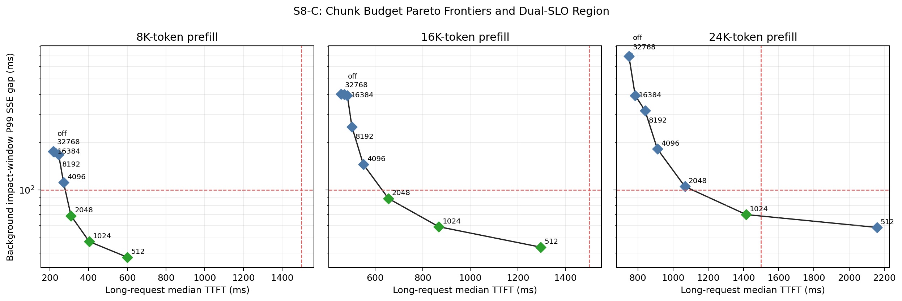

# S8-C results: TTFT–decode-gap Pareto frontier

S8-C reuses the 120 registered injection trials from the completed S8 formal
run. It does not add a second workload or select a new result after observing
new GPU measurements. For each prompt length and chunk budget, the run is the
statistical unit and the report shows medians with bootstrap 95% intervals.

The two service objectives are:

- background impact-window P99 SSE gap at or below 100 ms;
- injected long-request median TTFT at or below 1,500 ms.

## Result

The feasible set narrows as prefill length grows. At 8K and 16K, budgets of
2K, 1K, and 512 tokens satisfy both objectives. At 24K, only the 1K budget
satisfies both: its median P99 gap is 70.0 ms and its median TTFT is 1,415.6
ms. The 512-token setting lowers the gap to 58.1 ms but misses the TTFT SLO at
2,158.8 ms.

| Prefill | Configuration | Median TTFT | Median P99 gap | Both SLOs |
|---:|---|---:|---:|:---:|
| 8K | off | 220.4 ms | 174.0 ms | no |
| 8K | 2K | 309.4 ms | 68.7 ms | yes |
| 8K | 1K | 403.8 ms | 47.3 ms | yes |
| 16K | off | 470.2 ms | 399.4 ms | no |
| 16K | 2K | 656.0 ms | 88.4 ms | yes |
| 16K | 1K | 867.9 ms | 58.7 ms | yes |
| 24K | off | 752.2 ms | 700.9 ms | no |
| 24K | 4K | 911.0 ms | 181.4 ms | no |
| 24K | 2K | 1,067.4 ms | 105.2 ms | no |
| **24K** | **1K** | **1,415.6 ms** | **70.0 ms** | **yes** |
| 24K | 512 | 2,158.8 ms | 58.1 ms | no |



The frontier supports a policy conclusion rather than a universal parameter
claim. Larger budgets favor prompt responsiveness; smaller budgets protect
active decode streams. The 1K result is the observed dual-SLO choice for this
A100, model, workload, and FCFS configuration.

## Weighted objective

The generated policy map evaluates:

```text
J(alpha) = alpha * (TTFT / 1500 ms)
         + (1 - alpha) * (P99 SSE gap / 100 ms)
```

for `alpha` from 0 to 1 in steps of 0.05. This makes the preference explicit:
`alpha=0` values decode protection, while `alpha=1` values long-request TTFT.
The weighted score is a policy aid; the raw two-dimensional frontier remains
the primary result.

## Artifacts and reproduction

- [`pareto_summary.csv`](../results/s8/analysis/pareto/20260908T144356Z/pareto_summary.csv)
- [`weighted_policy_map.csv`](../results/s8/analysis/pareto/20260908T144356Z/weighted_policy_map.csv)
- [`audit.json`](../results/s8/analysis/pareto/20260908T144356Z/audit.json)

```bash
python src/s8_analyze_pareto.py \
  --trial-summary results/s8/analysis/formal/20260908T144356Z/trial_summary.csv \
  --output-dir results/s8/analysis/pareto/20260908T144356Z
```
