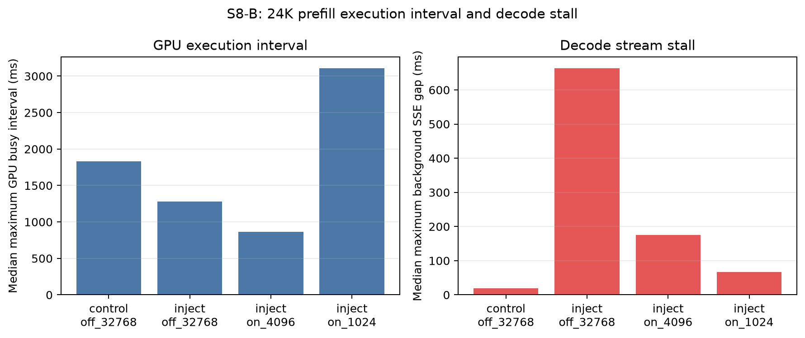

# S8-B: GPU execution mechanism results

## Result

Twenty diagnostic trials completed on one NVIDIA A100 80GB PCIe: five rotated
runs for a no-injection control and five runs for each 24K-prefill scheduler
configuration. Every trial produced an Nsight Systems report and a matching
client trace. The audit treats a run as the statistical unit and reports
bootstrap 95% confidence intervals.

| Case | Maximum kernel, median | GPU busy interval, median | Background P99 stall ratio | Maximum SSE gap | Long-request TTFT |
|---|---:|---:|---:|---:|---:|
| no injection, off | 0.335 ms | 1,832.6 ms | 1.18x | 19.6 ms | n/a |
| 24K, off / 32K | 12.696 ms | 1,279.3 ms | 57.30x | 663.9 ms | 729.8 ms |
| 24K, on / 4K | 4.189 ms | 867.1 ms | 13.97x | 174.9 ms | 896.4 ms |
| 24K, on / 1K | 1.864 ms | 3,110.3 ms | 4.99x | 67.0 ms | 1,381.5 ms |

Relative to unchunked execution, the 4K budget reduced the longest observed
kernel by 67.0% and the background stall ratio by 75.6%. The 1K budget reduced
them by 85.3% and 91.3%, respectively. The latency cost was a 22.8% TTFT
increase at 4K and an 89.3% increase at 1K. Scheduler waiting and preemption
remained zero in all cases, so the improvement is not explained by queue
drainage or eviction.

## Mechanism interpretation

The individual-kernel evidence supports the proposed mechanism: forcing
smaller prefill chunks sharply bounded the longest kernel while the matched
client-side decode gap fell in the same order. This is direct evidence that
the chunk budget changes GPU execution granularity, consistent with more
frequent decode scheduling opportunities.

The preregistered 50-microsecond *busy-interval union* did not pass its
monotonic criterion. Its median fell at 4K but rose to 3,110.3 ms at 1K. At
near-continuous GPU occupancy, many short kernels separated by less than the
merge threshold become one long union; the longer 1K TTFT also extends the
impact window. The union therefore measures dense aggregate activity and
capture duration as well as kernel granularity. It is retained as a negative
result and is not used as the causal evidence.

Nsight instrumentation adds overhead, and client-to-GPU alignment is only
approximate because the profile endpoint and CUDA events use different clock
origins. The completed S8 client experiment remains the source of the primary
latency result; this diagnostic run only tests the execution mechanism.

## Artifacts

- `results/s8/analysis/profile/20260909T202623Z/profile_aggregate_summary.csv`
- `results/s8/analysis/profile/20260909T202623Z/profile_trial_summary.csv`
- `results/s8/analysis/profile/20260909T202623Z/audit.json`
- `results/s8/analysis/profile/20260909T202623Z/environment.txt`
- `results/s8/analysis/profile/20260909T202623Z/protocol.txt`

Raw `.nsys-rep`, SQLite, kernel-event, server-log, and request-trace files are
retained on the experiment volume and excluded from Git.
